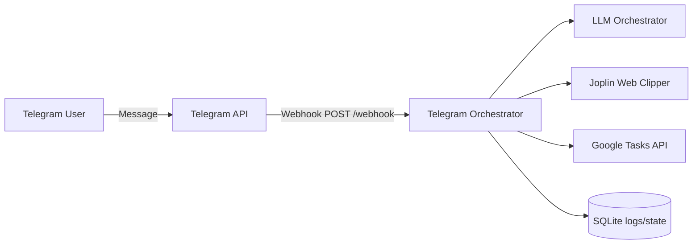

# Documentation Hub

This repository has documentation for different audiences.

Planning artifacts are intentionally kept out of `docs/`.
Feature requests, sprint plans, and implementation summaries live in `project-management/`.

## Audience Guides

- Business analyst: `docs/for-business-analyst/README.md`
- Senior developer: `docs/for-senior-developers/README.md`
- Developer: `docs/for-developers/README.md`
- End users: `docs/for-users/README.md`

## Architecture Snapshot

## Workflow Guides

- [GTD + Second Brain Workflow](for-users/gtd-second-brain-workflow.md) — How to use Google Tasks (GTD) and Joplin (Second Brain) together, with full project examples.
- [Where things go in PARA](para-where-to-put.md) — Quick reference for deciding Projects vs Areas vs Resources vs Archive.

## Reference

- [Google Tasks OAuth and token refresh](google-tasks-oauth-and-token-refresh.md) — Why tokens expire, how we preserve the refresh token, when re-authorization is needed.
- [Fly.io scheduled scaling](fly-scheduled-scaling.md) — Run 6am–10pm, scale to zero at night, wake on first request.

## Runtime and Root Hygiene

- Runtime data should live under `data/` (for local development) or `/app/data` (in Fly.io).
- Avoid creating new runtime artifacts at repository root.
- Use env vars `LOGS_DB_PATH` and `STATE_DB_PATH` to control SQLite file locations.
