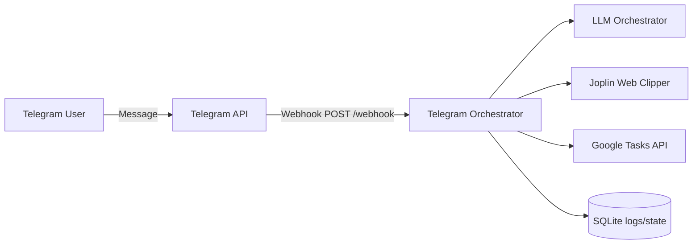

# Documentation Hub

This repository has documentation for different audiences.

Planning artifacts are intentionally kept out of `docs/`.
Feature requests, sprint plans, and implementation summaries live in `project-management/`.

## Audience Guides

- Business analyst: `docs/for-business-analyst/README.md`
- Senior developer: `docs/for-senior-developers/README.md`
- Developer: `docs/for-developers/README.md`
- End users: `docs/for-users/README.md`

## Architecture Snapshot

## Runtime and Root Hygiene

- Runtime data should live under `data/` (for local development) or `/app/data` (in Fly.io).
- Avoid creating new runtime artifacts at repository root.
- Use env vars `LOGS_DB_PATH` and `STATE_DB_PATH` to control SQLite file locations.
