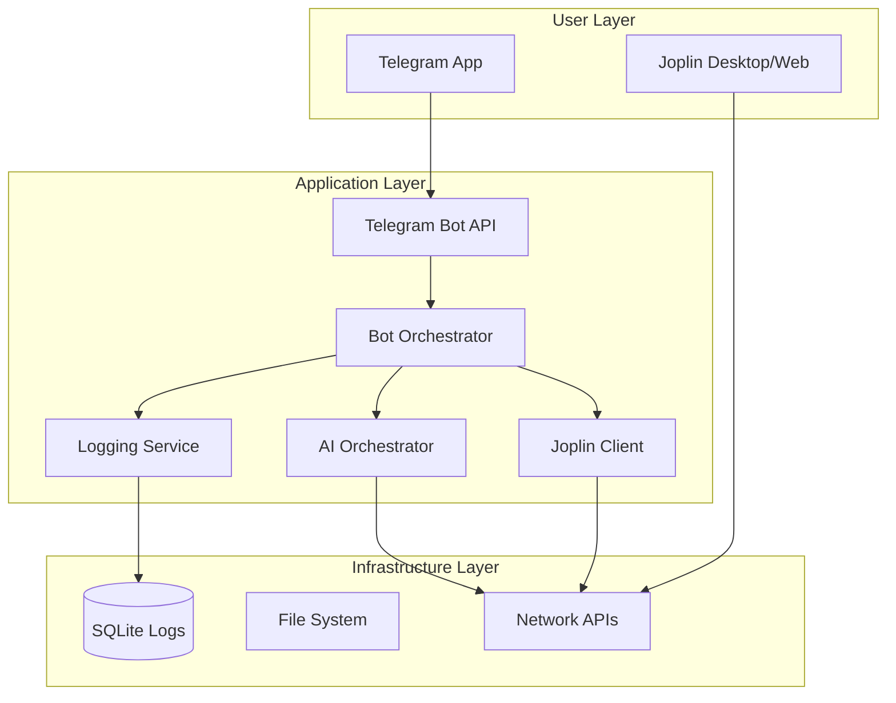
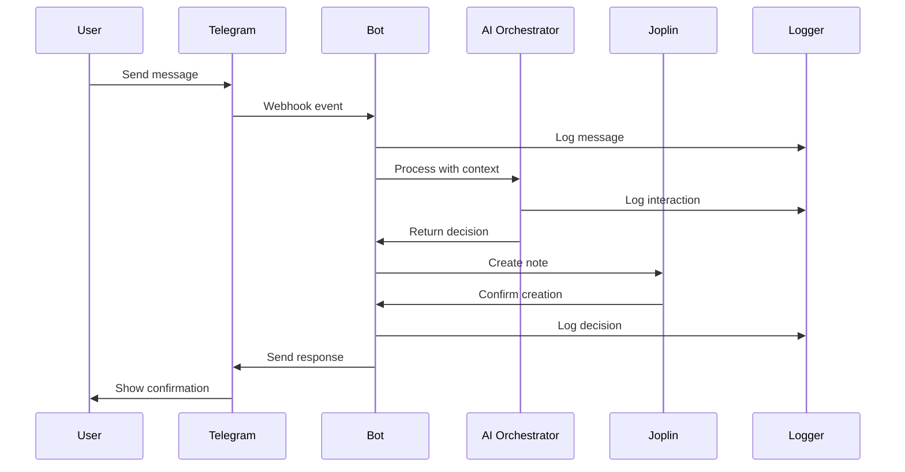
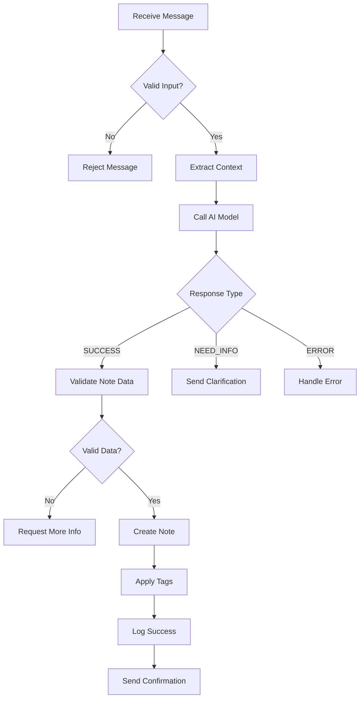
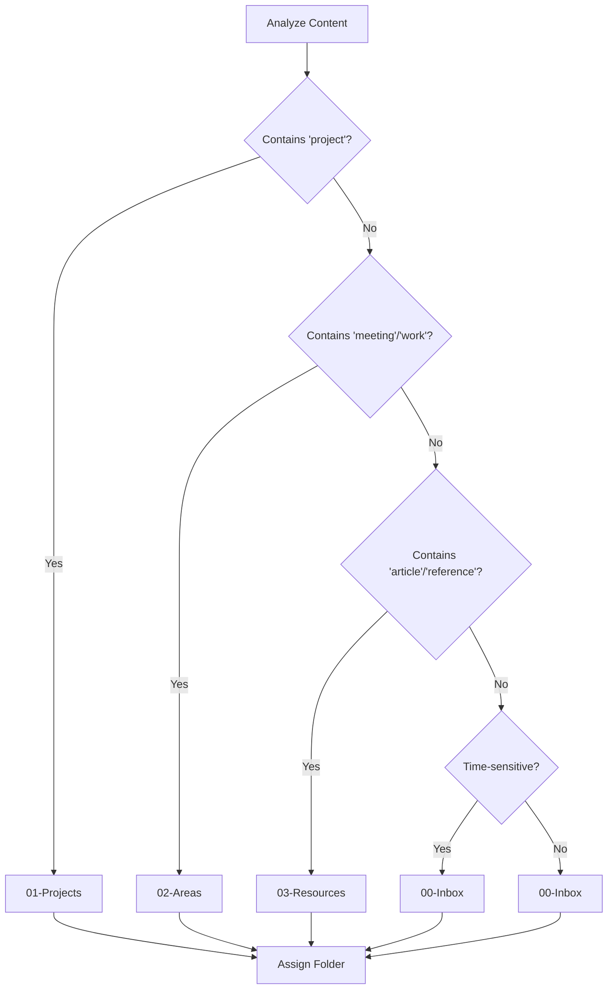
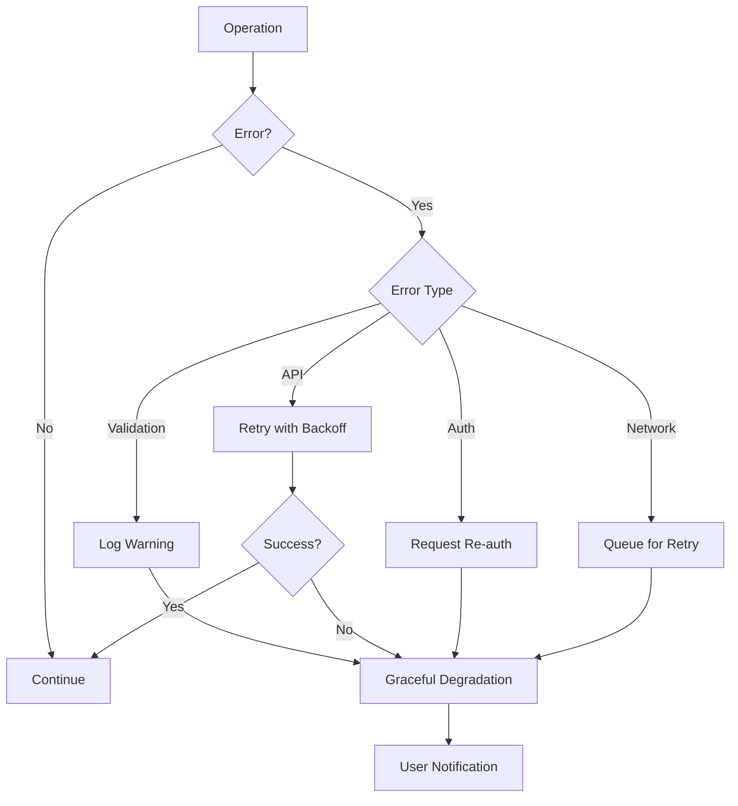
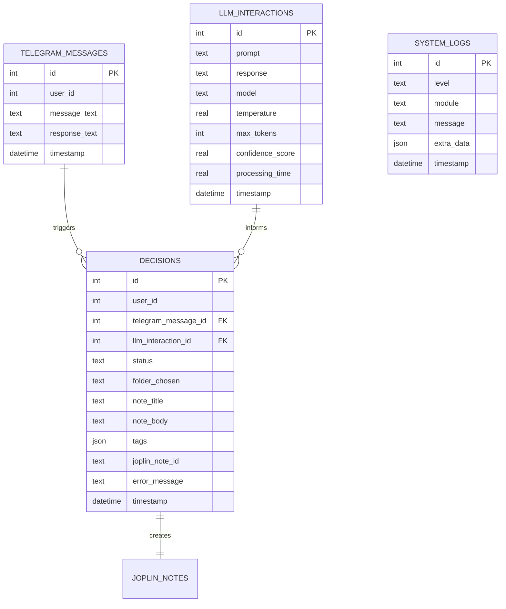

# System Architecture Diagrams

## High-Level Architecture

```mermaid
graph TB
    subgraph "User Layer"
        T[Telegram App]
        J[Joplin Desktop/Web]
    end

    subgraph "Application Layer"
        TB[Telegram Bot API]
        BO[Bot Orchestrator]
        AI[AI Orchestrator]
        JC[Joplin Client]
        LS[Logging Service]
    end

    subgraph "Infrastructure Layer"
        DB[(SQLite Logs)]
        FS[File System]
        NET[Network APIs]
    end

    T --> TB
    TB --> BO
    BO --> AI
    BO --> JC
    BO --> LS
    AI --> NET
    JC --> NET
    LS --> DB
    J --> NET
```

## Message Processing Flow

```mermaid
sequenceDiagram
    participant U as User
    participant T as Telegram
    participant B as Bot
    participant A as AI Orchestrator
    participant J as Joplin
    participant L as Logger

    U->>T: Send message
    T->>B: Webhook event
    B->>L: Log message
    B->>A: Process with context
    A->>L: Log interaction
    A->>B: Return decision
    B->>J: Create note
    J->>B: Confirm creation
    B->>L: Log decision
    B->>T: Send response
    T->>U: Show confirmation
```

## AI Decision Flow

```mermaid
flowchart TD
    A[Receive Message] --> B{Valid Input?}
    B -->|No| C[Reject Message]
    B -->|Yes| D[Extract Context]
    D --> E[Call AI Model]
    E --> F{Response Type}
    F -->|SUCCESS| G[Validate Note Data]
    F -->|NEED_INFO| H[Send Clarification]
    F -->|ERROR| I[Handle Error]
    G --> J{Valid Data?}
    J -->|No| K[Request More Info]
    J -->|Yes| L[Create Note]
    L --> M[Apply Tags]
    M --> N[Log Success]
    N --> O[Send Confirmation]
```

## Folder Selection Logic

```mermaid
flowchart TD
    A[Analyze Content] --> B{Contains 'project'?}
    B -->|Yes| C[01-Projects]
    B -->|No| D{Contains 'meeting'/'work'?}
    D -->|Yes| E[02-Areas]
    D -->|No| F{Contains 'article'/'reference'?}
    F -->|Yes| G[03-Resources]
    F -->|No| H{Time-sensitive?}
    H -->|Yes| I[00-Inbox]
    H -->|No| J[00-Inbox]

    C --> K[Assign Folder]
    E --> K
    G --> K
    I --> K
    J --> K
```

## Error Handling Flow

```mermaid
flowchart TD
    A[Operation] --> B{Error?}
    B -->|No| C[Continue]
    B -->|Yes| D{Error Type}
    D -->|Validation| E[Log Warning]
    D -->|API| F[Retry with Backoff]
    D -->|Auth| G[Request Re-auth]
    D -->|Network| H[Queue for Retry]
    E --> I[Graceful Degradation]
    F --> J{Success?}
    J -->|Yes| C
    J -->|No| I
    G --> I
    H --> I
    I --> K[User Notification]
```

## Database Schema

```mermaid
erDiagram
    TELEGRAM_MESSAGES ||--o{ DECISIONS : triggers
    LLM_INTERACTIONS ||--o{ DECISIONS : informs
    DECISIONS ||--|| JOPLIN_NOTES : creates

    TELEGRAM_MESSAGES {
        int id PK
        int user_id
        text message_text
        text response_text
        datetime timestamp
    }

    LLM_INTERACTIONS {
        int id PK
        text prompt
        text response
        text model
        real temperature
        int max_tokens
        real confidence_score
        real processing_time
        datetime timestamp
    }

    DECISIONS {
        int id PK
        int user_id
        int telegram_message_id FK
        int llm_interaction_id FK
        text status
        text folder_chosen
        text note_title
        text note_body
        json tags
        text joplin_note_id
        text error_message
        datetime timestamp
    }

    SYSTEM_LOGS {
        int id PK
        text level
        text module
        text message
        json extra_data
        datetime timestamp
    }
```