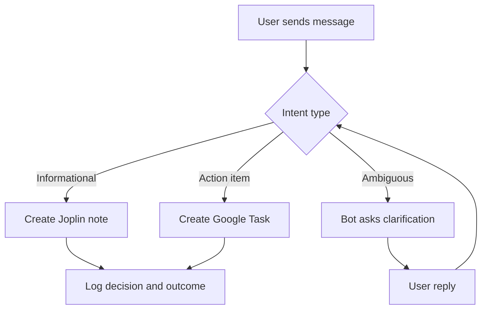
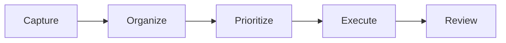

# Business Analyst Guide

This guide explains product behavior and business workflows without implementation-heavy details.

## Product Scope

- Input channel: Telegram chat
- Knowledge system: Joplin notes (source of truth)
- Action system: Google Tasks (optional)
- Intelligence layer: LLM classification and enrichment
- Reporting: Daily priorities and pending clarifications

## Core Workflow

## Value Streams

## State Management

- [State Management (Business Overview)](state-management.md) — How the bot remembers conversations, clarification flows, persona sessions, and escape hatches.

## Key Business KPIs

- Capture success rate (messages processed without manual intervention)
- Clarification rate (messages requiring follow-up questions)
- Task conversion rate (action-oriented messages converted to tasks)
- Time-to-response (user perceived latency)
- Daily report adoption (scheduled or on-demand usage)
