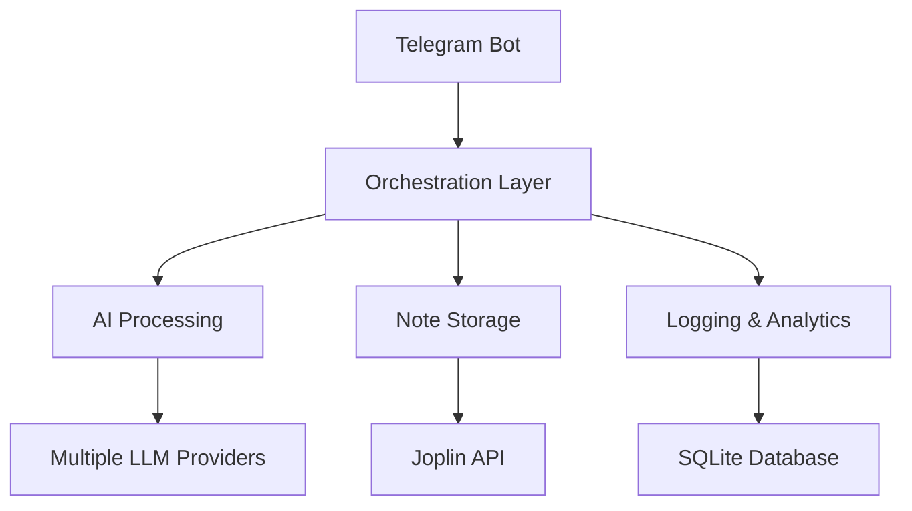

# Business Owner Documentation

## Executive Summary

The Telegram-Joplin AI Note Bot is a productivity tool that leverages artificial intelligence to automatically organize and create structured notes from Telegram messages. It integrates seamlessly with Joplin, a popular open-source note-taking application, to provide intelligent note categorization and tagging.

## Value Proposition

### Key Benefits

- **Time Savings**: Automatic note creation and organization eliminates manual data entry
- **Improved Organization**: AI-powered folder selection and tagging ensures consistent note structure
- **Enhanced Productivity**: Capture ideas and information instantly without workflow interruption
- **Cost Effective**: Open-source components with optional low-cost AI services

### Target Users

- Knowledge workers who capture information frequently
- Teams needing consistent documentation practices
- Individuals managing personal knowledge bases
- Organizations implementing note-taking workflows

## Technical Architecture

### System Overview



### Components

- **Telegram Integration**: Handles incoming messages and user interactions
- **AI Orchestration**: Processes natural language and makes intelligent decisions
- **Joplin Client**: Manages note creation and organization
- **Logging Service**: Tracks usage and performance for optimization
- **Security Layer**: Ensures authorized access and data protection

## Deployment Guide

### Prerequisites

- Server with Python 3.9+ support
- Joplin instance (self-hosted or cloud)
- Telegram Bot API access
- AI service API keys (optional for local models)

### Installation Steps

1. **Environment Setup**
   ```bash
   git clone <repository>
   cd telegram-joplin
   ./setup.sh
   ```

2. **Configuration**
   - Obtain Telegram bot token from BotFather
   - Configure Joplin Web Clipper API
   - Set up AI provider credentials
   - Configure authorized user access

3. **Testing**
   ```bash
   python test_setup.py
   python main.py  # Test run
   ```

4. **Production Deployment**
   - Use process manager (systemd/pm2)
   - Configure log rotation
   - Set up monitoring
   - Enable automatic restarts

### Cost Analysis

#### Monthly Operating Costs

| Component | Cost | Notes |
|-----------|------|--------|
| Server (VPS) | $5-20 | Depends on traffic |
| AI API (DeepSeek) | $0.01-1 | Per 1K tokens |
| Telegram API | Free | No usage limits |
| Joplin | Free | Open source |
| **Total** | **$5-21** | Low operational cost |

#### Development Costs

- Initial setup: 1-2 days
- Customization: 1-5 days depending on requirements
- Maintenance: 2-4 hours/month

## ROI Calculation

### Time Savings

**Assumptions:**
- User captures 20 notes/week manually
- Each note takes 3 minutes to organize
- 50 weeks/year operation

**Calculation:**
- Manual time: 20 notes × 3 min × 50 weeks = 50 hours/year
- With bot: ~5 minutes setup/week = 4.17 hours/year
- **Time savings: 45.83 hours/year per user**

### Productivity Impact

- **Knowledge Capture**: Instant note creation encourages more frequent documentation
- **Search Efficiency**: Consistent tagging and folders improve information retrieval
- **Team Collaboration**: Standardized note formats enhance sharing and collaboration

### Break-Even Analysis

- Development cost: $2,000-5,000
- Annual savings per user: $1,000+ (at $25/hour rate)
- Break-even: 2-5 users or 6-12 months

## Usage Metrics

### Key Performance Indicators

- **Note Creation Rate**: Notes created per day/week
- **User Engagement**: Active users vs. total authorized
- **Processing Speed**: Average response time
- **Error Rate**: Failed note creation percentage
- **Folder Accuracy**: Correct folder assignment rate

### Monitoring Dashboard

The system includes built-in logging for:
- Usage statistics
- Performance metrics
- Error tracking
- User activity patterns

## Risk Assessment

### Technical Risks

- **AI Accuracy**: Initial folder/tag assignment may need refinement
- **API Dependencies**: Reliance on external services (Telegram, AI providers)
- **Data Privacy**: Secure handling of user messages

### Mitigation Strategies

- **Iterative Improvement**: Use logging data to train and improve AI decisions
- **Fallback Mechanisms**: Graceful degradation when services unavailable
- **Security Measures**: Encrypted storage, access controls, audit logging

### Business Risks

- **Adoption Resistance**: Users preferring manual methods
- **Integration Issues**: Compatibility with existing workflows
- **Maintenance Overhead**: Ongoing updates and support

## Support and Maintenance

### Ongoing Requirements

- **System Updates**: Monthly dependency updates
- **Performance Monitoring**: Weekly log review
- **User Support**: As needed for configuration issues
- **AI Model Tuning**: Quarterly review of categorization accuracy

### Support Model

- **Self-Service**: Comprehensive documentation
- **Community Support**: GitHub issues and discussions
- **Professional Services**: Available for custom deployments

## Future Roadmap

### Planned Enhancements

- **Advanced AI Features**: Custom categorization rules, sentiment analysis
- **Multi-User Collaboration**: Shared note spaces, team workflows
- **Integration APIs**: Connect with other productivity tools
- **Mobile Optimization**: Enhanced mobile experience

### Scaling Considerations

- **User Growth**: Horizontal scaling for multiple instances
- **Performance Optimization**: Caching, async processing improvements
- **Enterprise Features**: SSO, audit trails, compliance logging

## Conclusion

The Telegram-Joplin AI Note Bot offers a compelling solution for organizations seeking to improve their knowledge management and productivity workflows. With low operational costs, quick implementation, and measurable time savings, it provides excellent value for knowledge workers and teams.

The open-source nature ensures long-term viability and customization potential, while the modular architecture allows for future enhancements and integrations.