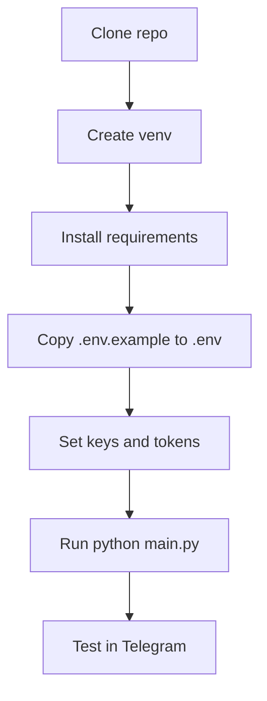
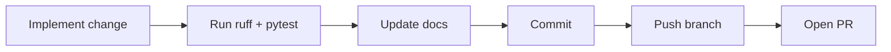

# Developer Guide

This guide helps contributors run, debug, and extend the bot safely.

## Local Development Flow

## Where to Make Changes

- Commands and user interactions: `src/handlers/`
- Service logic: `src/*_service.py`, `src/*_orchestrator.py`
- External integrations: `src/joplin_client.py`, `src/google_tasks_client.py`
- Settings and env vars: `src/settings.py`, `.env.example`
- Health/webhooks: `src/webhook_server.py`

## Runtime Files

- Local default paths:
  - `data/bot/bot_logs.db`
  - `data/bot/conversation_state.db`
- Configure with:
  - `LOGS_DB_PATH`
  - `STATE_DB_PATH`

## Contribution Flow

