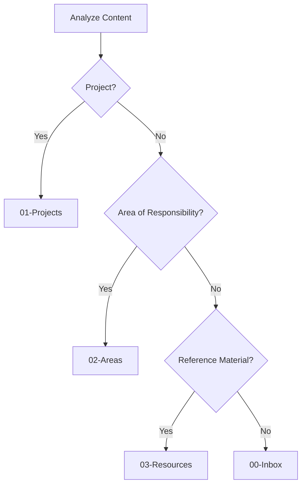

# LLM Integration Documentation

## Overview

This document provides specifications for integrating with the Telegram-Joplin bot's AI capabilities. It covers API endpoints, data formats, prompt engineering guidelines, and integration patterns.

## API Specifications

### Message Processing Endpoint

**Purpose**: Process natural language messages and generate structured note responses

**Input Format**:
```json
{
  "message": "Meeting notes from client call about new website project",
  "context": {
    "existing_tags": ["meeting", "client", "project"],
    "folders": [
      {"id": "abc123", "title": "01-Projects"},
      {"id": "def456", "title": "02-Areas"}
    ]
  }
}
```

**Output Format**:
```json
{
  "status": "SUCCESS|NEED_INFO|ERROR",
  "confidence_score": 0.0-1.0,
  "question": "Clarification question (if NEED_INFO)",
  "log_entry": "Decision reasoning",
  "note": {
    "title": "Generated note title",
    "body": "Full note content",
    "parent_id": "folder_id",
    "tags": ["tag1", "tag2"]
  }
}
```

### Status Codes

- **SUCCESS**: Note successfully generated
- **NEED_INFO**: Additional clarification required
- **ERROR**: Processing failed

## Integration Patterns

### Function Calling (OpenAI/DeepSeek)

The system uses structured function calling for reliable output parsing:

```python
functions = [{
    "name": "create_joplin_note",
    "description": "Create a structured note in Joplin",
    "parameters": {
        "type": "object",
        "properties": {
            "status": {"type": "string", "enum": ["SUCCESS", "NEED_INFO"]},
            "confidence_score": {"type": "number", "minimum": 0, "maximum": 1},
            "question": {"type": "string"},
            "log_entry": {"type": "string"},
            "note": {
                "type": "object",
                "properties": {
                    "title": {"type": "string"},
                    "body": {"type": "string"},
                    "parent_id": {"type": "string"},
                    "tags": {"type": "array", "items": {"type": "string"}}
                }
            }
        },
        "required": ["status", "confidence_score", "log_entry"]
    }
}]
```

### Structured Prompting (Ollama/Local)

For models without function calling, use structured prompts:

```
Analyze this user message and respond with a JSON object in this exact format:
{
  "status": "SUCCESS" or "NEED_INFO",
  "confidence_score": 0.0 to 1.0,
  "question": "if NEED_INFO",
  "log_entry": "your reasoning",
  "note": {"title": "...", "body": "...", "parent_id": "...", "tags": [...]}
}
```

## Prompt Engineering Guidelines

### Core Instructions

**Primary Goal**: Convert natural language messages into structured Joplin notes

**Key Principles**:
1. **Conservative Categorization**: Only create notes when confidence > 0.8
2. **Complete Information**: Require all essential fields (title, body, folder, tags)
3. **User Intent Preservation**: Maintain original meaning and context
4. **Consistent Structure**: Use established folder/tag conventions

### Folder Selection Rules



**Folder Guidelines**:
- **01-Projects**: Active work with deadlines
- **02-Areas**: Ongoing responsibilities (work, home, health)
- **03-Resources**: Reference materials, documentation
- **00-Inbox**: Default for unclear categorization
- **04-Archive**: NEVER use - for completed items only

### Tagging Strategy

**Automatic Tags**:
- Content type: meeting, email, idea, recipe, book
- Context: personal, work, urgent, follow-up
- Domain: technical, creative, administrative

**Tag Creation Rules**:
- Use existing tags when possible
- Create specific, reusable tags
- Avoid over-tagging (max 5 tags)
- Use kebab-case for multi-word tags

### Confidence Scoring

**1.0 (Very High)**: Clear, complete information
- Explicit folder mention
- All context provided
- No ambiguity

**0.8-0.9 (High)**: Good understanding
- Inferred folder from content
- Complete task description
- Standard use case

**0.7 (Medium)**: Reasonable assumption
- Multiple possible interpretations
- Missing some context
- Non-standard request

**< 0.7 (Low)**: Need clarification
- Ambiguous content
- Missing key information
- Unusual request type

### Error Handling

**NEED_INFO Triggers**:
- Unclear folder destination
- Missing essential details
- Multiple interpretations possible
- Inappropriate content

**Clarification Questions**:
- Specific: "What folder should this go in?"
- Contextual: "Is this work-related or personal?"
- Guided: "Choose from: Projects, Areas, Resources"

## Integration Examples

### Python Integration

```python
from src.llm_orchestrator import LLMOrchestrator

# Initialize
orchestrator = LLMOrchestrator(provider_name="deepseek")

# Process message
context = {
    "existing_tags": ["meeting", "project"],
    "folders": [
        {"id": "proj123", "title": "01-Projects"},
        {"id": "area456", "title": "02-Areas"}
    ]
}

result = orchestrator.process_message("Team meeting notes for website redesign", context)

if result.status == "SUCCESS":
    print(f"Note created: {result.note['title']}")
elif result.status == "NEED_INFO":
    print(f"Clarification needed: {result.question}")
```

### API Integration

```python
import requests

response = requests.post("http://localhost:8000/process", json={
    "message": "User input here",
    "context": {"folders": [...], "tags": [...]}
})

result = response.json()
# Handle result as above
```

## Performance Optimization

### Token Management

- Limit context to recent/relevant items
- Use efficient prompt structures
- Cache folder/tag lookups
- Implement conversation memory limits

### Response Time Targets

- Function calling: < 3 seconds
- Structured prompting: < 5 seconds
- Clarification responses: < 2 seconds

### Accuracy Metrics

- Folder assignment accuracy: > 85%
- Tag relevance: > 90%
- False positive rate: < 5%

## Testing and Validation

### Test Cases

**High Confidence**:
- "Create project plan for Q1 marketing campaign" → 01-Projects, tags: project, marketing

**Medium Confidence**:
- "Interesting article about AI" → 03-Resources, tags: article, ai

**Low Confidence**:
- "Note" → NEED_INFO: "What should the note contain?"

### Validation Scripts

Use provided test suites:
```bash
python test_llm.py  # LLM integration tests
python test_setup.py  # System validation
```

## Troubleshooting

### Common Issues

**Inconsistent Categorization**:
- Review prompt guidelines
- Check folder definitions
- Validate context data

**Low Confidence Scores**:
- Improve prompt specificity
- Add more context
- Refine decision rules

**Performance Issues**:
- Reduce prompt length
- Optimize API calls
- Implement caching

### Debug Mode

Enable detailed logging:
```python
import logging
logging.basicConfig(level=logging.DEBUG)
```

Check logs in `bot_logs.db` for interaction details.