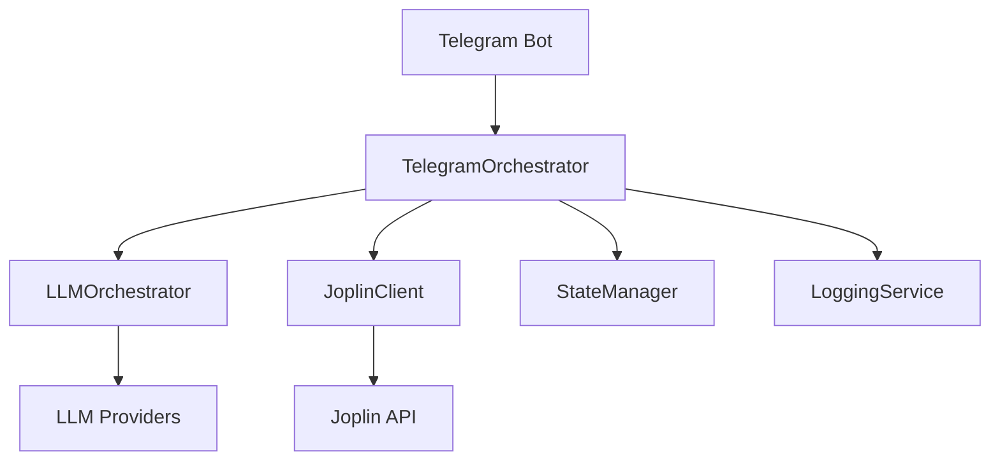
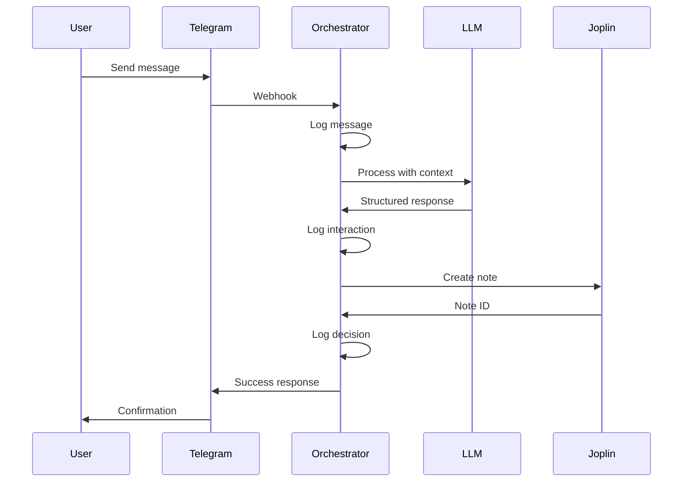

# Programmer Documentation

## Architecture Overview

The Telegram-Joplin bot is built with a modular architecture using Python asyncio for handling Telegram messages and creating notes in Joplin.

### System Components

### Key Modules

- **telegram_orchestrator.py**: Main bot logic, handles incoming messages and coordinates components
- **llm_orchestrator.py**: AI-powered note generation and decision making
- **joplin_client.py**: REST API client for Joplin operations
- **state_manager.py**: Conversation state management for clarifications — see [State Management](state-management.md) for full technical reference
- **logging_service.py**: SQLite database logging for debugging
- **security_utils.py**: Input validation and security checks

### Data Flow

## Setup for Development

### Prerequisites

- Python 3.9+
- Joplin with Web Clipper enabled
- API keys for chosen LLM provider

### Installation

1. Clone repository
2. Run `./setup.sh` or manually install dependencies
3. Configure `.env` file
4. Run `python test_setup.py` to verify

### Development Environment

Use virtual environment activated with `source activate.sh`

### Testing

- Unit tests: `python -m pytest`
- Integration tests: `python test_setup.py`
- LLM tests: `python test_llm.py`

## API Reference

### TelegramOrchestrator

Main class handling bot operations.

#### Methods

- `handle_message()`: Process incoming text messages
- `handle_start()`: Handle /start command
- `_process_llm_response()`: Process AI responses and create notes

### LLMOrchestrator

Handles AI interactions.

#### Methods

- `process_message()`: Generate structured note responses

### JoplinClient

REST API client for Joplin.

#### Methods

- `create_note()`: Create new note
- `get_folders()`: Retrieve folder list
- `apply_tags()`: Tag notes

### LoggingService

Database logging service.

#### Methods

- `log_telegram_message()`: Log user messages
- `log_llm_interaction()`: Log AI interactions
- `get_recent_messages()`: Query recent activity

## Configuration

Environment variables in `.env`:

- `TELEGRAM_BOT_TOKEN`: BotFather token
- `ALLOWED_TELEGRAM_USER_IDS`: Authorized users
- `LLM_PROVIDER`: openai/deepseek/ollama
- `JOPLIN_WEB_CLIPPER_TOKEN`: Joplin API token

## Error Handling

- Validation in `security_utils.py`
- Exception logging to database
- Graceful degradation for API failures

## Performance Considerations

- Async operations for I/O
- SQLite for lightweight logging
- Caching of folder/tag data
- Rate limiting via Telegram API