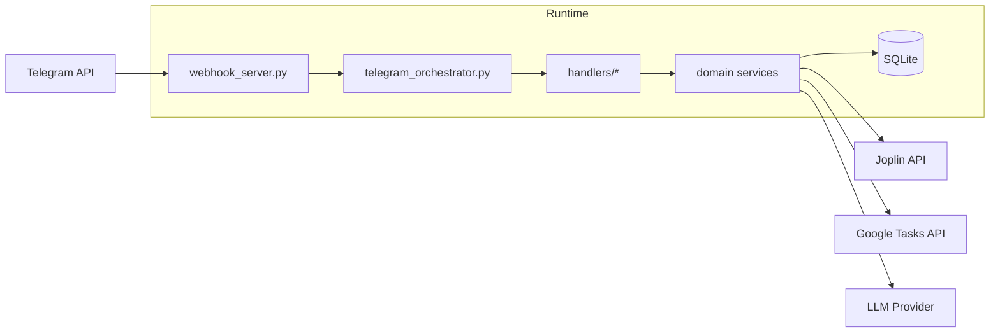
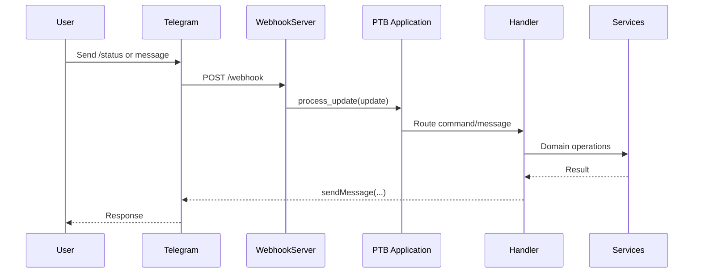

# Senior Developer Guide

This guide focuses on architecture, boundaries, reliability, and extension points.

## System Topology

## Webhook Request Path

## Design Notes

- Orchestrator remains thin; command logic belongs to `src/handlers/`.
- Runtime mode is environment-driven: webhook in Fly.io, polling locally.
- Durable state and audit logs are SQLite-backed.
- Joplin and bot are co-located in one container to simplify networking.

## Suggested Next Refactors

- Introduce repository interfaces for SQLite access.
- Add command-level integration tests for all handlers.
- Add explicit health/readiness split (`/health` vs `/ready`).
