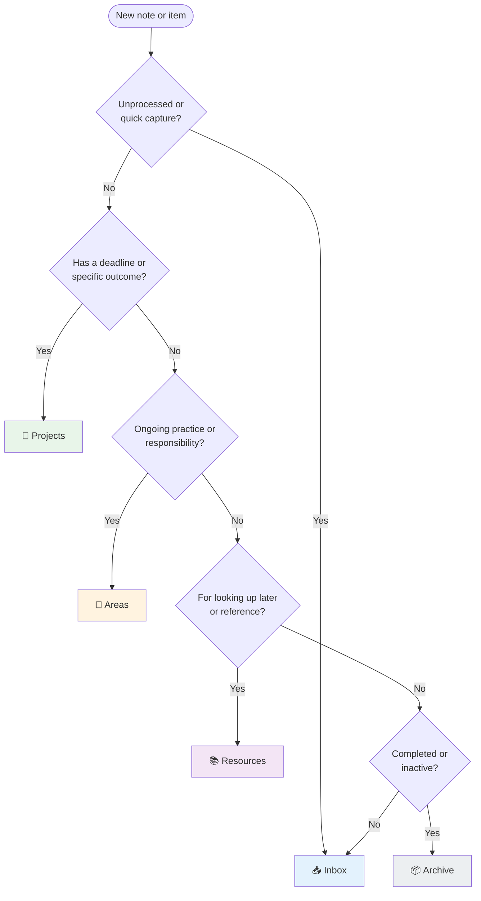
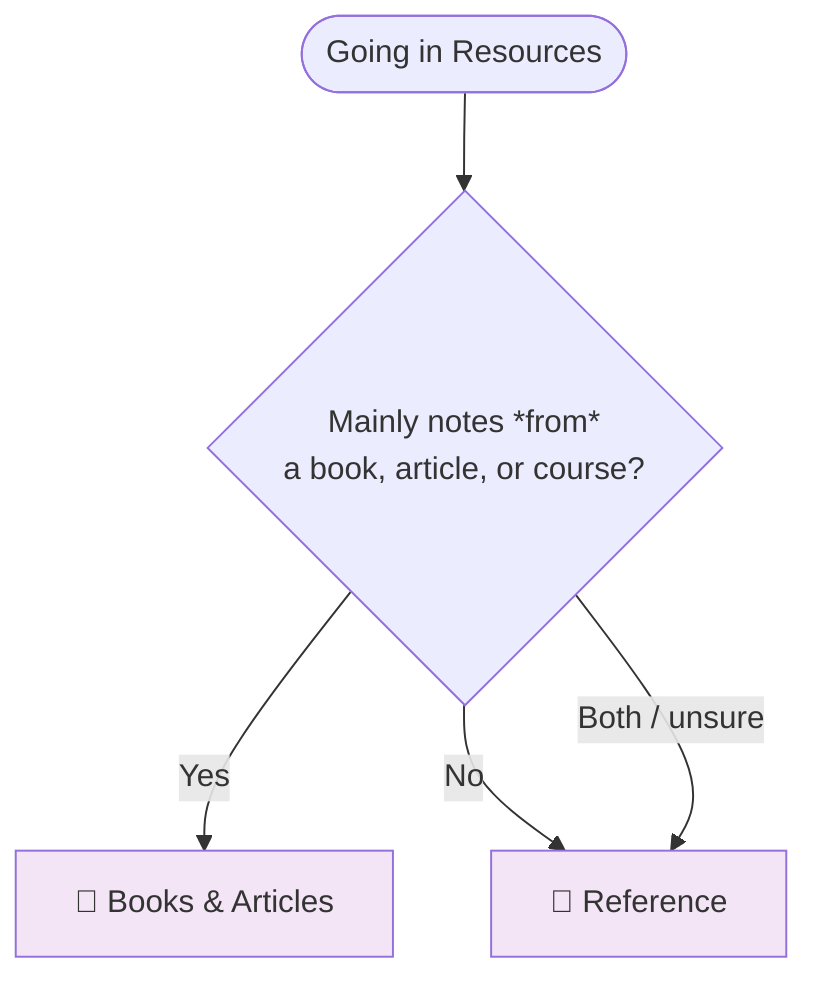

# Where things go in PARA

Quick reference for deciding **Projects** vs **Areas** vs **Resources** vs **Archive**.

---

## Flow: Which folder?

---

## Flow: Which subfolder under Resources?

---

## Journals (dream, stoic, gratitude, etc.)

**→ Areas**

Journals are **ongoing practices** you maintain, not one-off projects or reference material. Put them under **Areas**.

The default `/reorg_init` creates **Areas → 📓 Journaling** with subfolders:

- **Dream Journal**
- **Stoic Journal**
- **Other** (gratitude, morning pages, etc.)

Create or move journal notes into the right subfolder. If you use a different template (e.g. "roles"), the same **📓 Journaling** area is created there too.

---

## Quick PARA reminder

| Bucket      | Use for |
|------------|---------|
| **Projects** | Goal with a deadline or outcome (e.g. "Ship app", "Plan trip"). |
| **Areas**    | Ongoing responsibilities and practices (work, health, finance, **journaling**). |
| **Resources** | Reference material: articles, books, templates, how-tos. |
| **Archive**   | Completed projects or inactive areas. |

---

## Books & Articles vs Reference (under Resources)

| Folder | Use for |
|--------|--------|
| **📖 Books & Articles** | Notes *from* something you read: book highlights, article summaries, course notes from a book or published course. The **source** is a book, article, or course. |
| **🔗 Reference** | Material you **refer back to**: docs, official guides, cheat sheets, how-tos, your own distilled notes on a topic. Use when the main purpose is "look this up later." |

Overlap is fine: an article summary can sit in Books & Articles; the same content, if you use it as reference, could be thought of as Reference. When in doubt: **Books & Articles** = "I read this"; **Reference** = "I use this when I need it."

---

## Learning notes (e.g. Laravel, a framework, a language)

**→ Resources → Reference** (or **Resources → 📖 Books & Articles** if they're mainly notes *from* a book/course).

Notes you took **while learning Laravel** (docs, tutorials, your own snippets and summaries) are reference material: you'll look them up when you use Laravel. Put them in **Resources → Reference**. You can add a tag like `laravel` or create a subfolder **Reference → Laravel** to group by topic.

If the notes are mostly **from** a specific book or course (e.g. "Laravel: Up and Running"), **Resources → 📖 Books & Articles** is also a good fit.

---

## Recipes

**→ Resources** (and optionally **Resources → Recipes** or **Resources → Reference**).

Recipes are reference material: you look them up when you cook. Put them in **Resources**. The bot already sends recipe URLs to Resources (or a **Recipes** folder if you have one). You can:

- Create a subfolder **Resources → Recipes** and keep all recipe notes there, or
- Use **Resources → Reference** and tag notes with `recipe` (the bot adds a `recipe` tag for recipe notes).

No need to put them in Books & Articles unless the note is mainly a summary *from* a cookbook.

---

## Other "where does this go?" examples

- **Daily / weekly reviews** → Areas (e.g. under Journaling or a "Productivity" area).
- **Meeting notes for an active project** → Projects (in that project's folder).
- **Saving a quote or idea for later** → Resources (or a note in the relevant Area).
- **Finished project** → Move the whole project folder (or its notes) to Archive.
