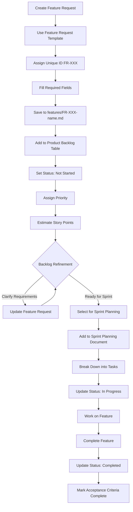
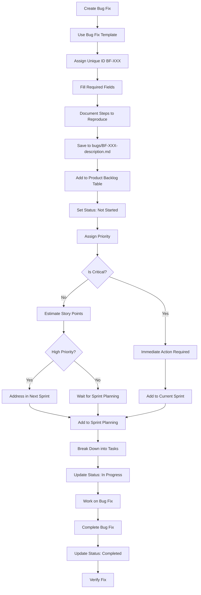
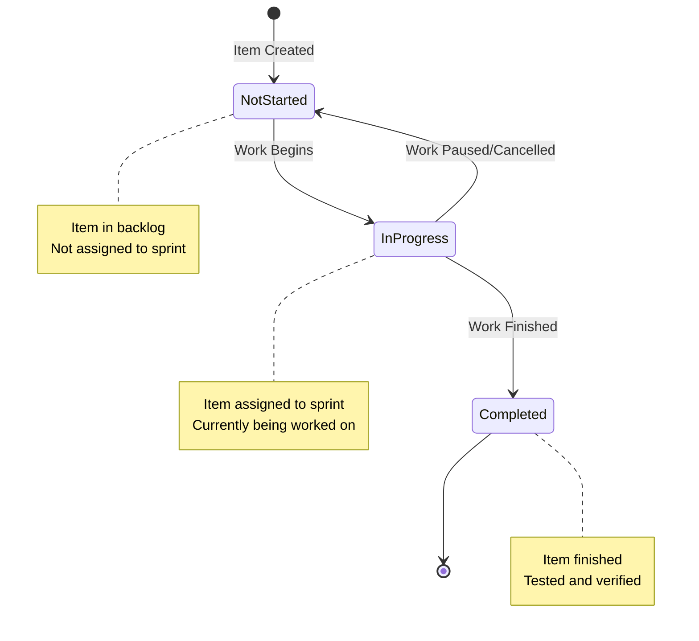

# Feature Request: FR-002 - Add Mermaid Workflow Diagrams for Backlog Management

**Status**: ✅ Completed  
**Priority**: 🟠 High  
**Story Points**: 5 (Fibonacci: 1, 2, 3, 5, 8, 13)  
**Created**: 2026-01-01  
**Updated**: 2026-01-01  
**Assigned Sprint**: Sprint 1

## Description

Add Mermaid.js flow diagrams to document and visualize the complete workflow of feature requests and bug fixes from initial creation through backlog management to sprint planning. These diagrams will provide a visual representation of the processes defined in the backlog management process document, making it easier for team members to understand the lifecycle and flow of backlog items.

## User Story

As a team member (developer, product owner, or scrum master), I want visual workflow diagrams using Mermaid.js that show how feature requests and bug fixes flow from creation to sprint planning, so that I can quickly understand the process, identify where items are in the workflow, and ensure proper procedures are followed.

## Acceptance Criteria

- [x] Mermaid flowchart diagram created showing feature request workflow (creation → backlog → refinement → sprint planning)
- [x] Mermaid flowchart diagram created showing bug fix workflow (creation → backlog → immediate action/sprint planning)
- [x] Mermaid state diagram created showing status lifecycle (Not Started → In Progress → Completed)
- [x] Diagrams integrated into backlog management process document
- [x] Diagrams include decision points (e.g., critical bug vs. regular bug)
- [x] Diagrams include all key steps from the process document
- [x] Diagrams are properly formatted and render correctly in markdown viewers
- [x] Diagrams reference relevant sections of the process document
- [x] Example diagrams added to examples folder for reference

## Business Value

This feature improves process understanding and adoption by:
- Providing visual representation of complex workflows
- Making it easier for new team members to understand the process
- Reducing confusion about where items should be in the workflow
- Enabling quick reference during backlog refinement and sprint planning
- Improving process compliance by making steps clear and visible
- Supporting documentation and training efforts

## Technical Requirements

- Use Mermaid.js syntax for flowcharts and state diagrams
- Diagrams must render in common markdown viewers (GitHub, GitLab, VS Code, etc.)
- Include proper node labels and decision points
- Use consistent styling and color coding where applicable
- Diagrams should be embedded in markdown files
- Create separate diagrams for feature requests and bug fixes
- Include status lifecycle diagram
- Reference specific sections of backlog-management-process.md

## Reference Documents

- Backlog Management Process: `backlog-toolkit/processes/backlog-management-process.md`
- Product Backlog Structure: `backlog-toolkit/processes/product-backlog-structure.md`
- Sprint Planning Template: `backlog-toolkit/templates/sprint-planning-template.md`
- Feature Request Template: `backlog-toolkit/templates/feature-request-template.md`
- Bug Fix Template: `backlog-toolkit/templates/bug-fix-template.md`

## Technical References

- Process document: `backlog-toolkit/processes/backlog-management-process.md`
- Examples folder: `backlog-toolkit/examples/`
- Mermaid.js documentation: https://mermaid.js.org/

## Dependencies

- None - This is a documentation enhancement that can be implemented independently

## Notes

- Mermaid.js is widely supported in markdown viewers (GitHub, GitLab, VS Code, etc.)
- Diagrams should complement, not replace, the detailed process documentation
- Consider creating both detailed and simplified versions of diagrams
- Diagrams should be updated if the process changes
- This feature enhances the existing backlog management process documentation

## Proposed Mermaid Diagrams

### Feature Request Workflow

### Bug Fix Workflow

### Status Lifecycle

## History

- 2026-01-01 - Created
- 2026-01-01 - Status changed to ⏳ In Progress, Assigned to Sprint 1
- 2026-01-01 - Status changed to ✅ Completed (all diagrams integrated and tested)

