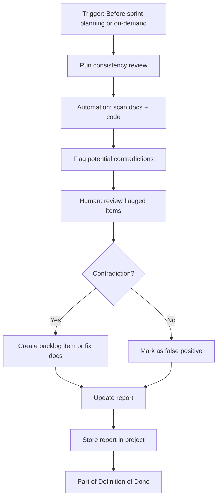

# Feature Request: FR-036 - Documentation-Code Consistency Review (Pre-Sprint Planning)

**Status**: ⏳ In Progress  
**Priority**: 🟠 High  
**Story Points**: 8  
**Created**: 2026-03-05  
**Updated**: 2026-03-06  
**Assigned Sprint**: Sprint 13

## Description

Add a **Documentation-Code Consistency Review** step to the project-management process. This step runs **before sprint planning** (and on-demand) to compare all documentation against the entire codebase, detect problems across **16 categories** (see [Documentation-Code Consistency Problems](../docs/processes/documentation-code-consistency-problems.md)), and produce a report. The review is **hybrid**: automation flags potential issues; a human reviews and decides. The report is stored in the project and becomes part of the **Definition of Done**.

**Example (Category 1.1)**: Documentation states "The system supports 3 organizational frameworks." The code actually implements 5. The review would flag this as "1.1 Conflicting Counts/Options" so docs can be updated or the discrepancy can be resolved.

## User Story

As a team member responsible for project quality,
I want a pre-sprint documentation-code consistency review that flags contradictions between docs and code,
so that we catch mismatches (e.g. doc says 3 options, code has 5) before they cause confusion, and our docs stay accurate.

## Current State

- No formal step to compare documentation vs code
- Contradictions can persist (doc outdated, code evolved)
- Sprint planning proceeds without doc/code alignment check
- No Definition of Done document exists

## Proposed Flow



## Acceptance Criteria

### Process Integration

- [ ] **Pre-sprint planning**: Consistency review is a required step *before* sprint planning. Sprint planning checklist includes: "Documentation-Code Consistency Review completed; report generated."
- [ ] **On-demand**: Team can run the review anytime via documented command or script (e.g. `./scripts/doc-code-review.sh` or manual checklist).
- [ ] **Definition of Done**: Create or update Definition of Done to include: "Documentation-Code Consistency Review run this sprint (or since last sprint); no unresolved high-priority contradictions."

### Scope

- [ ] **Documentation**: All docs in scope — `docs/`, `project-management/`, `README.md`, and any other markdown/doc files in the repo.
- [ ] **Code**: Entire codebase — `src/`, `config.py`, `main.py`, tests, and any code that docs reference.

### Hybrid Review (Automation + Human)

- [ ] **Automation**: Script or tool that:
  - Scans docs for references to code (file paths, class names, function names, option counts, command lists, etc.)
  - Scans code for structure (files, classes, functions, constants, config options)
  - Compares and flags potential contradictions (e.g. doc lists 3 options, code has 5; doc references `old_handler.py`, file renamed)
- [ ] **Human review**: Flagged items are reviewed by a human who decides: real contradiction (fix) vs false positive (ignore).
- [ ] **Output**: Report lists flagged items with status: Open, Resolved, False Positive.

### Report

- [ ] **Format**: Markdown report stored in project (e.g. `project-management/reports/doc-code-consistency-YYYY-MM-DD.md` or `project-management/reports/doc-code-consistency-latest.md`).
- [ ] **Content**: For each flagged item: doc reference, code reference, **category** (1–16 from taxonomy), description of contradiction, severity (High/Medium/Low), status, resolution notes.
- [ ] **Retention**: Keep last N reports (e.g. 3) or one "latest" plus dated archive.

### Problem Categories (from Taxonomy)

The review targets all 16 categories defined in [Documentation-Code Consistency Problems](../docs/processes/documentation-code-consistency-problems.md):

| # | Category | Automation Priority | Human Review |
|---|----------|---------------------|--------------|
| 1 | **Explicit Contradictions** (counts, params, return values, behavior) | MVP | Required |
| 2 | **Inconsistencies** (terminology, examples, conflicting docs, UI mismatch) | MVP | Required |
| 3 | **Stale Documentation** (version drift, deprecated features, new features undocumented, config changes, migration path) | MVP | Required |
| 4 | **Incomplete Docs** (edge cases, setup, permissions, constraints, side effects) | Phase 2 | Required |
| 5 | **Defaults & Implicit Behavior** (undocumented defaults, type coercion, null handling) | Phase 2 | Required |
| 6 | **Error Handling** (undocumented errors, format mismatch, wrong codes) | Phase 2 | Required |
| 7 | **Performance** (characteristics undocumented, resource requirements) | Phase 2 | Required |
| 8 | **Dependencies** (version mismatches, compatibility, database requirements) | Phase 2 | Required |
| 9 | **API Changes** (signature, response format, endpoint paths, required vs optional) | MVP | Required |
| 10 | **Workflows** (missing steps, prerequisites, conditional behavior) | Phase 2 | Required |
| 11 | **Configuration** (option names/values changed, required config not documented) | Phase 2 | Required |
| 12 | **Data Types** (type mismatches, format mismatches, enum/choice mismatches) | Phase 2 | Required |
| 13 | **Security** (features undocumented, auth changes, permission requirements) | Phase 2 | Required |
| 14 | **Logging/Diagnostics** (log format, debug modes, monitoring) | Phase 3 | Required |
| 15 | **Backwards Compatibility** (breaking changes, deprecation, upgrade path) | Phase 2 | Required |
| 16 | **Examples** (non-working, incomplete, deprecated examples) | Phase 2 | Required |

- [ ] **MVP (Phase 1)**: Automation checks for Categories 1, 2, 3, 9. Human review for all flagged items.
- [ ] **Phase 2**: Extend automation to Categories 4–8, 10–13, 15, 16.
- [ ] **Phase 3**: Add Categories 14 (logging/diagnostics) as automation matures.

## Business Value

- **Reduces confusion**: Developers and stakeholders rely on accurate docs; contradictions cause wasted time and wrong assumptions.
- **Improves trust**: When docs match code, the system is easier to onboard, maintain, and extend.
- **Catches drift early**: Code evolves faster than docs; this step surfaces drift before it compounds.
- **Supports Definition of Done**: Explicit quality gate for documentation accuracy.

## Technical Requirements

### Automation Approach

**Option A — Script-based** (recommended for MVP):
- Python or shell script that:
  - Parses docs for patterns (file paths, class names, "X options", "Y commands", etc.)
  - Parses code (e.g. `ast` for Python, `grep` for patterns)
  - Outputs a structured list of potential contradictions
- Can use `grep`, `rg`, or simple regex for doc scanning
- No external services required
- **Phased checks** per [documentation-code-consistency-problems.md](../docs/processes/documentation-code-consistency-problems.md): MVP = Categories 1, 2, 3, 9; Phase 2 = 4–8, 10–13, 15, 16; Phase 3 = 14

**Option B — LLM-assisted** (future):
- Use LLM to compare doc excerpts with code excerpts and suggest contradictions
- Higher accuracy but adds cost and latency; consider for later iteration

### Report Schema (Example)

```markdown
# Documentation-Code Consistency Report
**Date**: YYYY-MM-DD
**Trigger**: Pre-sprint planning | On-demand
**Reviewer**: [Name]

## Summary
- Total flagged: N
- Open: X | Resolved: Y | False Positive: Z

## Items

| # | Doc | Code | Category | Description | Severity | Status |
|---|-----|------|----------|-------------|----------|--------|
| 1 | docs/brain-dump.md | src/handlers/braindump.py | 1.1 Conflicting Counts | Doc says 3 phases; code has 4 | High | Open |
| 2 | README.md | src/ | 3.2 Deprecated Features | Doc references deprecated /old_command | Medium | Resolved |
| 3 | docs/LLM_GUIDE.md | config.py | 11.1 Config Names | Doc says maxConnections; code uses max_connections | Medium | Open |
```

### Integration Points

- **Backlog Management Process**: Add "Documentation-Code Consistency Review" to pre-sprint planning section.
- **Sprint Planning Template**: Add checklist item: "Doc-Code Consistency Review completed."
- **Definition of Done**: New document or section in process docs.

## Reference Documents

- [Documentation-Code Consistency Problems](../docs/processes/documentation-code-consistency-problems.md) — **16-category taxonomy** for designing checks and review criteria
- [Backlog Management Process](../docs/processes/backlog-management-process.md) — where to add the step
- [Sprint Planning Template](../docs/templates/sprint-planning-template.md) — checklist update
- [Sprint and Backlog Planning](../docs/sprint-and-backlog-planning.md) — planning flow

## Technical References

- Directory: `docs/` — user and technical documentation
- Directory: `project-management/` — backlog, templates, process docs
- Directory: `src/` — main codebase
- File: `README.md` — project overview

## Dependencies

- None. Can be implemented independently.

## Notes

- **MVP (Phase 1)**: Script-based automation for Categories 1 (Explicit Contradictions), 2 (Inconsistencies), 3 (Stale), 9 (API Changes). Checks: file/class references, option counts, command lists, deprecated references, version strings.
- **Phase 2**: Add Categories 4–8, 10–13, 15, 16. Requires deeper code analysis (AST, config parsing, error handling patterns).
- **Phase 3**: Category 14 (Logging/Diagnostics) — lower priority, often manual.
- **Severity**: High = doc is wrong and could mislead; Medium = doc is incomplete; Low = minor inconsistency.
- **Category tagging**: Each report item tagged with taxonomy category (e.g. "1.1 Conflicting Counts", "3.2 Deprecated Features") for trend analysis and prioritization.
- **Frequency**: Per sprint (before planning) is sufficient; on-demand for major releases or when someone suspects drift.
- **Owner**: Assign a role (e.g. Tech Lead, Doc Owner) to run the review and update the report.

## History

- 2026-03-05 - Created from user request for doc/code review step in project-management process
