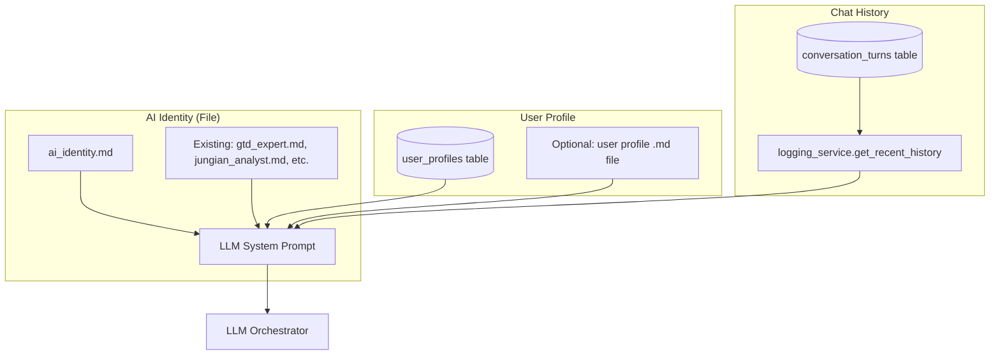

# Feature Request: FR-038 - AI Identity, User Profile, and Chat History

**Status**: ⭕ Not Started
**Priority**: 🟡 Medium
**Story Points**: 8
**Created**: 2026-03-06
**Updated**: 2026-03-06
**Assigned Sprint**: Backlog

## Description

Add persistent storage for three components that enable a more personalized, context-aware AI experience:

1. **AI Identity** — A central file defining the bot's persona, values, and communication style
2. **User Profile** — A per-user file or record with information about the user ("about me") that the AI can reference
3. **Chat History** — Persistent storage and retrieval of conversation history for context in ongoing interactions

This feature enables the AI to maintain continuity across sessions, remember user preferences, and respond in a consistent, personalized way.

## User Story

As a user who interacts with the bot regularly,
I want the AI to know who it is, know who I am, and remember our past conversations,
so that our interactions feel continuous, personalized, and contextually aware.

## Design Decision: File-Based vs Table-Based

### Comparison

| Aspect | File-Based | Table-Based | Hybrid (Recommended) |
|-------|------------|-------------|----------------------|
| **AI Identity** | ✅ Human-editable, version control | ❌ Overkill for single global config | ✅ File (already exists: `src/prompts/`) |
| **User Profile** | ✅ Portable, readable "about me" | ✅ Queryable, structured fields | ✅ Both: table for prefs + optional file for free-form |
| **Chat History** | ❌ Concurrency, no query | ✅ Indexed, retention, existing schema | ✅ Table (extend `telegram_messages` / `llm_interactions`) |
| **Editability** | ✅ Direct edit, no migration | ❌ Requires schema changes | — |
| **Backup** | ✅ Git, copy file | ✅ SQLite dump | — |
| **Token limits** | ⚠️ Need summarization for long history | Same | Same |

### Recommended Architecture: Hybrid



### Rationale

- **AI Identity**: File-based. The bot has one global identity. Personas (GTD expert, Jungian analyst) already live in `src/prompts/`. Add `ai_identity.md` or `bot_core_persona.md` as the base identity that all personas inherit or reference. Human-editable, no schema.

- **User Profile**: File-based for single-user. `data/user_profile.md` with work context, preferences, goals, manifesto, professional/personal goals, timezone. Edited via inline text, multi-turn Q&A, or manual file edit.

- **Chat History**: Table-based. `telegram_messages` and `llm_interactions` already exist. Add a `conversation_turns` table or extend existing; add daily summary records. Fetch last 10–25 turns verbatim + older days as summaries. Use for `history=` in `process_message()`.

## Acceptance Criteria

### AI Identity

- [ ] `src/prompts/ai_identity.md` (or equivalent) defines the bot's core identity
- [ ] Identity includes: name, role, values, communication style, boundaries, tone
- [ ] Identity is loaded and prepended to system prompts for default note/task routing and normal conversation only
- [ ] In flows like `/dream`, `/braindump`, use flow-specific persona (no base identity inheritance)
- [ ] Identity can be updated via bot commands
- [ ] Existing personas (GTD, Jungian, etc.) can reference or extend the base identity

### User Profile

- [ ] Single-user profile storage (`data/user_profile.md` or equivalent)
- [ ] Profile includes: work context, preferences, goals, constraints, communication preferences, manifesto, professional goals, personal goals, timezone
- [ ] User can set/update profile via mix of: inline text, multi-turn Q&A, manual file edit
- [ ] Profile content is injected into LLM context when processing messages

### Chat History

- [ ] Conversation history is persisted (table or extend existing)
- [ ] Daily summary ("resume") is created at end of day; only summaries are used as history
- [ ] Recent turns (last 10–25 verbatim) + older summaries passed to `process_message(history=...)`
- [ ] History is editable by user
- [ ] Retention: forever, but only in resume/summary format
- [ ] History is used across all flows

## Business Value

- **Continuity**: Users don't have to repeat context; the AI remembers prior conversations
- **Personalization**: "About me" and preferences make responses more relevant
- **Consistency**: A defined identity makes the bot feel like a coherent assistant, not a generic LLM
- **Differentiation**: Few Telegram bots offer persistent identity + user profile + history

## Technical Requirements

### 1. AI Identity

- File: `src/prompts/ai_identity.md`
- Loaded at startup or on first use; cached in `LLMOrchestrator`
- Prepended to `_build_system_prompt()` for default note/task routing and normal conversation only; NOT prepended for persona flows (`/dream`, `/braindump`, etc.)

### 2. User Profile

**Option A — Table only** (multi-user, structured):

```sql
CREATE TABLE IF NOT EXISTS user_profiles (
    user_id INTEGER PRIMARY KEY,
    display_name TEXT,
    about_me TEXT,
    preferences TEXT,  -- JSON
    created_at DATETIME DEFAULT CURRENT_TIMESTAMP,
    updated_at DATETIME DEFAULT CURRENT_TIMESTAMP
);
```

**Option B — File only** (single-user, chosen):

- `data/user_profile.md` — Markdown with: work context, preferences, goals, constraints, communication preferences, manifesto, professional goals, personal goals, timezone
- Edited via inline text, multi-turn Q&A, or manual file edit

### 3. Chat History

**Option A — Extend existing**:

- Use `telegram_messages` + `llm_interactions`; add a `get_recent_conversation_turns(user_id, limit)` in `logging_service`

**Option B — New table**:

```sql
CREATE TABLE IF NOT EXISTS conversation_turns (
    id INTEGER PRIMARY KEY AUTOINCREMENT,
    user_id INTEGER NOT NULL,
    role TEXT NOT NULL,  -- 'user' | 'assistant'
    content TEXT NOT NULL,
    timestamp DATETIME DEFAULT CURRENT_TIMESTAMP
);
CREATE INDEX idx_conversation_turns_user_time ON conversation_turns(user_id, timestamp);
```

- Insert on each user message and assistant reply
- **Daily summary**: At end of day (user timezone), generate a "resume" of the day's conversation; store as summary record
- **History retrieval**: Last 10–25 turns verbatim + older days as summaries (editable)
- Query for `history=` parameter: recent turns + daily summaries

### 4. Integration Points

- `src/llm_orchestrator.py`: Load identity, accept user_profile context, use history
- `src/handlers/core.py`: Fetch user profile and history before calling `process_message`
- `src/logging_service.py`: Add `get_recent_conversation_turns()`, optionally `log_conversation_turn()`
- New handler: `/profile` or `/about_me` for user to set their profile

## Reference Documents

- [FR-010: Database Logging](FR-010-database-logging-telegram-llm-decisions.md) — Existing logging schema
- [FR-007: Conversation State Management](FR-007-conversation-state-management.md) — State manager
- [FR-017: GTD Expert Persona](FR-017-gtd-expert-persona.md) — Persona pattern
- [database_schema.sql](../../../database_schema.sql) — Current schema

## Technical References

- `src/llm_orchestrator.py` — `process_message()`, `_build_system_prompt()`, `_get_persona_prompt()`
- `src/prompts/` — Existing persona files
- `src/state_manager.py` — Per-session state (conversation_history in braindump)
- `src/logging_service.py` — `telegram_messages`, `llm_interactions`
- `database_schema.sql` — `report_configurations`, `telegram_messages`

## Dependencies

- None (can build incrementally: identity first, then profile, then history)

## Design Decisions (2026-03-06)

### AI Identity
- **Content**: Name, role, values, communication style, boundaries, tone
- **Scope**: Base identity applies only to default note/task routing and normal conversation. In flows like `/dream` or `/braindump`, use the flow-specific persona (no base identity inheritance in those flows)
- **Editing**: Identity can be updated via bot commands

### User Profile
- **Deployment**: Single-user
- **Content**: Work context, preferences, goals, constraints, communication preferences, manifesto, professional goals, personal goals
- **How to set**: Mix of inline text, multi-turn Q&A, and manual file edit
- **Timezone**: User timezone stored in profile

### Chat History
- **Scope**: All flows
- **Format**: Daily conversation summary ("resume") created at end of day; only summaries are used as history. History is editable
- **Retention**: Forever, but only in resume/summary format
- **Token budget**: Last N turns (recent messages) is sufficient
- **Industry best practice** (for N turns):
  - Keep 10–25 recent messages verbatim for immediate context
  - Summarize older messages; 50+ messages typically triggers summarization
  - Typical history budget: 500–10K tokens
  - Rolling window with summarization: recent in full, older as summaries

### Implementation
- **Build order**: Identity → profile → history
- **MVP**: User profile
- **Privacy**: No API keys, SSN, or credit card numbers in profile or history

## Open Questions

- ~~Single vs multi-user~~ → Single-user
- ~~History scope~~ → All flows
- ~~Token budget~~ → Last N turns; 10–25 verbatim, older summarized

## Notes

- **File format**: Use `.md` (Markdown) for all identity, profile, and persona files—not `.txt`
- Braindump and planning already use in-session `conversation_history` in state; this FR adds *persistent* cross-session history
- `CONVERSATION_HISTORY_LIMIT = 3` exists in constants; may need to increase or make configurable
- **Privacy**: Do not store API keys, SSN, or credit card numbers in profile or history

## History

- 2026-03-06 - Created
- 2026-03-06 - Design decisions: single-user, file-based profile, daily summary history, identity scope (default only), privacy constraints
