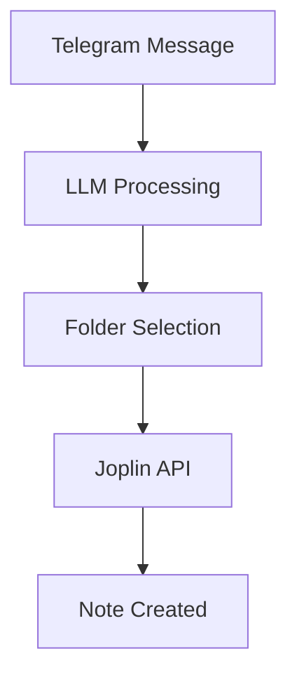

# User Story: US-011 - Comprehensive Project Documentation for Multiple Audiences

**Status**: ⏳ In Progress  
**Priority**: 🟡 Medium  
**Story Points**: 13  
**Created**: 2025-01-27  
**Updated**: 2025-01-27  
**Assigned Sprint**: Sprint 3  

## Description

Create comprehensive documentation for the Telegram-Joplin bot project targeting four distinct audiences: programmers (technical implementation), users (how to use the bot), business owners (value proposition and deployment), and LLMs (API specifications and integration guides). Include Mermaid diagrams for workflow visualization.

## User Story

As a stakeholder interested in the project, 
I want clear, targeted documentation for my role, 
so that I can understand, use, or support the system effectively.

## Acceptance Criteria

- [ ] Programmer documentation with code architecture, API references, and setup instructions
- [ ] User documentation with installation, configuration, and usage guides
- [ ] Business owner documentation with value proposition, deployment guide, and ROI analysis
- [ ] LLM documentation with API specifications, integration guides, and prompt engineering tips
- [ ] Mermaid workflow diagrams for system architecture and user flows
- [ ] README.md updated with overview and links to detailed docs
- [ ] Documentation hosted in docs/ directory with clear navigation
- [ ] All diagrams rendered correctly in Markdown

## Business Value

Enables faster onboarding of new developers, reduces support queries from users, and helps business stakeholders understand the product's value and deployment requirements. Improves overall project maintainability and adoption.

## Technical Requirements

- Use Mermaid syntax for diagrams in Markdown files
- Include code examples and API documentation
- Create separate sections/files for each audience
- Ensure documentation is version-controlled and up-to-date
- Include troubleshooting sections

## Reference Documents

- Current README.md - for baseline information
- Codebase structure - for technical documentation
- User stories and features - for user documentation

## Technical References

- Directory: `docs/` - Documentation location
- File: `README.md` - Main project overview
- Mermaid diagrams for workflows

## Dependencies

- Project structure finalized
- Core features implemented

## Notes

Documentation should include:

For Programmers:

For Users:
- Installation steps
- Configuration guide
- Usage examples

For Business Owners:
- Value proposition
- Deployment costs
- Maintenance requirements

## History

- 2025-01-27 - Created
- 2025-01-27 - Status changed to ⏳ In Progress, Assigned to Sprint 3</content>
<parameter name="filePath">project-management/backlog/user-stories/US-011-comprehensive-project-documentation.md