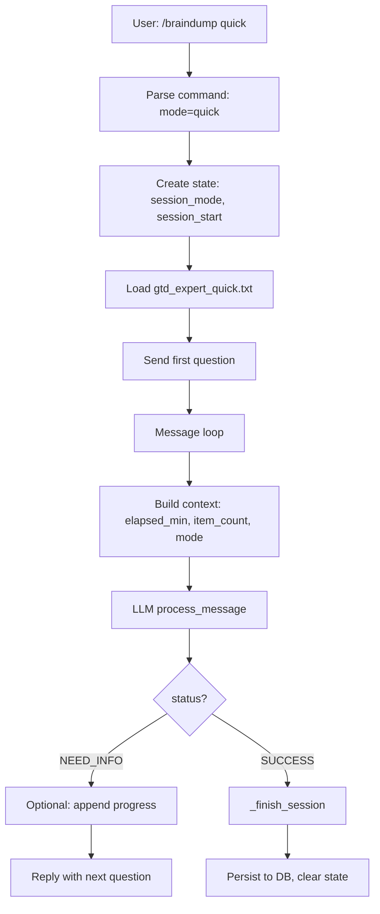

# User Story: US-035 - World-Class Brain Dump Experience

**Status**: ⏳ In Progress
**Priority**: 🟠 High
**Story Points**: 13
**Created**: 2026-03-05
**Updated**: 2026-03-08
**Assigned Sprint**: Sprint 17

## Description

Elevate the `/braindump` (GTD mind sweep) experience from "production-ready" to **world-class** by adding session flexibility, time awareness, progress visibility, personalization, and deeper integration with the GTD + Second Brain philosophy. The goal is to make brain dump the most trusted, delightful capture ritual in the user's productivity stack.

**Philosophy alignment** (from `docs/for-users/gtd-second-brain-workflow.md`):
- *"Capture everything. Don't trust your brain."*
- Brain dump is Step 2 in project workflows: "Braindump Everything You Know" before organizing into PARA
- Tasks (Google Tasks) = actions; Notes (Joplin) = knowledge
- Golden rule: *"If it's captured, you can let it go"*

## User Story

As a user who relies on brain dump to empty my head and reduce anxiety,
I want a flexible, time-aware, and personalized mind sweep experience that adapts to my context and shows progress,
so that I trust the system completely, use it consistently, and never lose a thought again.

## Current State (Gaps)

| Gap | Current | Impact |
|-----|---------|--------|
| **Session length** | Fixed 15 min only | Users with 5 min or 25 min can't adapt |
| **Time awareness** | LLM has no elapsed time | Sessions run too short or too long |
| **Progress visibility** | None | User doesn't know how far along they are |
| **Personalization** | None | Same flow for everyone |
| **Triggers** | Not implemented | US-017 suggested "think about boss/health" — never added |
| **Recurrence** | None | No "brain dump Friday" habit integration |
| **Output options** | Single Inbox note only | No PARA placement suggestions, no project split |
| **Follow-up tracking** | None | No "items captured → completed" metrics |
| **Session recovery** | State lost on timeout | Mid-session interruption = lose everything |
| **Quick capture** | Must start full session | No "dump one thing" mode |

## Proposed Improvements

### 1. Session Modes (Quick / Standard / Thorough)

- [ ] **Quick (5 min)**: Pressure Release + abbreviated sweep. Target 8–12 items. For "I have 5 minutes before a meeting."
- [ ] **Standard (15 min)**: Current behavior. Target 20–30 items. Default.
- [ ] **Thorough (25 min)**: Full sweep + extra paperwork + relationships/learning. Target 35–45 items. For weekly deep clean.

**UX**: `/braindump` (standard), `/braindump quick`, `/braindump thorough`, or `/capture 5` / `/capture 25`

### 2. Time Awareness & Progress Visibility

- [ ] Pass `elapsed_minutes` and `session_mode` into LLM context so it can pace appropriately
- [ ] After each user message, optionally reply with subtle progress: *"✓ 12 items · ~8 min left"* (user-configurable, off by default for minimal UX)
- [ ] LLM prompt: *"If elapsed_minutes >= (target - 2), transition to Stragglers even if categories incomplete"*

### 3. Cognitive Triggers (from US-017 Notes)

- [ ] Optional triggers injected at phase transitions: *"Think about your boss. Anything there?"* / *"Think about your health. Appointments? Prescriptions?"*
- [ ] Configurable per user: enable/disable, which triggers to use
- [ ] Stored in user preferences (new table or state)

### 4. Personalization & User Preferences

- [ ] User can set: default session mode, preferred categories to emphasize, skip categories (e.g. "I don't have paperwork")
- [ ] Optional: custom first question (e.g. "What's the one thing you're avoiding?")
- [ ] Stored in `user_preferences` or similar; loaded at session start

### 5. Smarter Output & PARA Integration

- [ ] **Option A**: Single note (current) — always available
- [ ] **Option B**: LLM suggests PARA placement per category: *"Work items → Projects/Active Work; Home → Areas/Home"*. User confirms or overrides.
- [ ] **Option C**: Split into multiple notes by project/area when items clearly belong to existing Joplin folders (requires folder list in context)
- [ ] Default: Option A. Options B/C opt-in via preference or `/braindump para`

### 6. Recurrence & Habit Integration

- [ ] `/braindump schedule` or integration with `/habits`: "Brain dump every Friday 9am"
- [ ] Reminder: *"🧠 Time for your weekly mind sweep! /braindump when ready."*
- [ ] Uses existing scheduler; new habit type "brain-dump"

### 7. Session Recovery & Resilience

- [ ] Persist session state to DB (not just in-memory) so reconnects after app restart don't lose session
- [ ] Timeout: after 30 min idle, send *"Session paused. Reply to resume or /braindump_stop to save what we have."*
- [ ] Resume: next message continues from last state

### 8. Quick Single-Item Capture

- [ ] `/dump one` or inline: *"dump: need to call dentist"* → single-item capture, no full session. Creates minimal note or appends to "Quick Captures" note.
- [ ] Reduces friction when user has one urgent thought

### 9. Follow-Up & Completion Metrics

- [ ] Log `items_captured` count per session in decision/analytics
- [ ] Weekly report: *"Last brain dump: 24 items. X completed, Y in progress."* (requires linking captured items to tasks/notes — stretch)
- [ ] Simple version: show "Items captured this session" in success message

### 10. Quality & Prompt Evolution

- [ ] A/B test framework (from `docs/brain-dump-prompt-tuning.md`): load variant prompts for % of users, compare metrics
- [ ] Metrics: comprehensiveness (categories covered), item count, session duration, user satisfaction (optional post-session "How thorough did this feel? 1–5")
- [ ] Prompt changelog: `PROMPT_CHANGELOG.md` for gtd_expert.txt

## Acceptance Criteria

### Must Have (MVP for "World-Class")

- [ ] Session modes: Quick (5 min), Standard (15 min), Thorough (25 min) — selectable via command args
- [ ] Time awareness: `elapsed_minutes` and `session_mode` passed to LLM context
- [ ] Progress visibility: optional "X items · ~Y min left" in replies (configurable, default off)
- [ ] Session recovery: persist state to DB; 30 min idle → "Session paused" message; resume on next message
- [ ] Quick single-item: `/dump one` or `/capture one` + single thought → minimal capture without full session

### Should Have

- [ ] Cognitive triggers: 2–3 optional triggers (boss, health, paperwork) at phase transitions; user preference to enable
- [ ] User preferences: default session mode, show/hide progress
- [ ] Smarter output: Option B — PARA placement suggestions (user confirms)
- [ ] Follow-up: "24 items captured" in success message; log to analytics

### Nice to Have

- [ ] Recurrence: brain dump habit + reminder
- [ ] A/B prompt testing framework
- [ ] Post-session satisfaction prompt (1–5)
- [ ] Option C: split into multiple notes by project

## Business Value

- **Differentiation**: Most GTD tools have rigid capture flows. A flexible, time-aware, personalized brain dump is rare and memorable.
- **Retention**: Users who trust the system use it weekly; habit integration drives recurring engagement.
- **Reduced anxiety**: "If it's captured, you can let it go" — world-class capture = stronger trust = less mental load.
- **Alignment with product vision**: GTD + Second Brain is the core philosophy; brain dump is the flagship capture ritual.

## Technical Requirements

- **State schema extension**: Add `session_mode`, `elapsed_minutes` (computed), `preferences` to session state
- **User preferences**: New table or extend existing; store `default_braindump_mode`, `show_progress`, `triggers_enabled`
- **State persistence**: Use DB-backed state for brain dump (not just in-memory) — align with existing state_manager if it supports persistence
- **Scheduler**: Reuse existing scheduler for brain dump reminders (see US-032 habit tracking)
- **LLM context**: Extend `process_message` context with `elapsed_minutes`, `session_mode`, `target_minutes`
- **Prompt variants**: Support loading `gtd_expert_quick.txt`, `gtd_expert_thorough.txt` based on mode

### Architecture (High Level)

## Reference Documents

- [Brain Dump Implementation Guide](../../../docs/brain-dump-implementation-guide.md)
- [Brain Dump Prompt Tuning](../../../docs/brain-dump-prompt-tuning.md)
- [GTD + Second Brain Workflow](../../../docs/for-users/gtd-second-brain-workflow.md)
- [BRAIN_DUMP_INDEX](../../../docs/BRAIN_DUMP_INDEX.md)
- [Where Things Go in PARA](../../../docs/para-where-to-put.md)
- [US-017 GTD Expert Persona](US-017-gtd-expert-persona.md) — original design, Notes section (triggers)
- [US-032 Habit Tracking](US-032-habit-tracking.md) — recurrence integration

## Technical References

- File: `src/handlers/braindump.py` — main handlers
- File: `src/prompts/gtd_expert.txt` — system prompt
- File: `src/llm_orchestrator.py` — `process_message()`, context building
- Class: `TelegramOrchestrator.state_manager` — state persistence
- Module: `src.task_service` — Google Tasks extraction (unchanged)

## Dependencies

- US-007 (Conversation State Management) — must support DB persistence for recovery
- US-032 (Habit Tracking) — for recurrence/reminder integration (optional)
- Existing scheduler — for brain dump reminders

## Notes

- **Phased rollout**: Implement Must Have first (modes, time awareness, recovery, quick capture), then Should Have, then Nice to Have.
- **Backward compatibility**: `/braindump` with no args = Standard (15 min) — current behavior preserved.
- **Prompt maintenance**: Each new mode (quick, thorough) needs a tuned prompt; start with parameterized single prompt, split to separate files if needed.
- **Philosophy**: Every improvement should reinforce "capture everything, don't trust your brain" — reduce friction, increase trust.

## History

- 2026-03-05 - Created from review of brain dump process, docs philosophy, and project-management backlog
