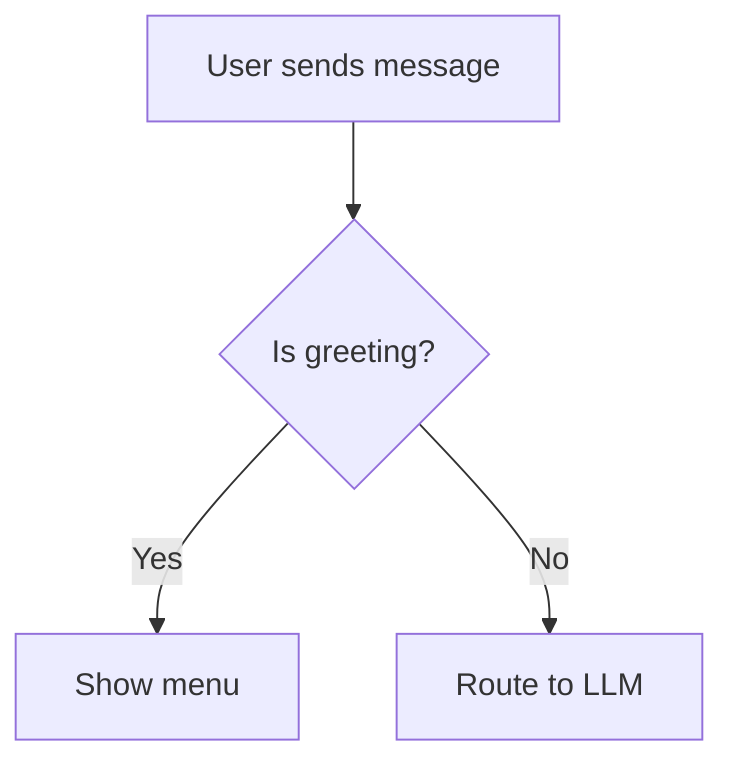
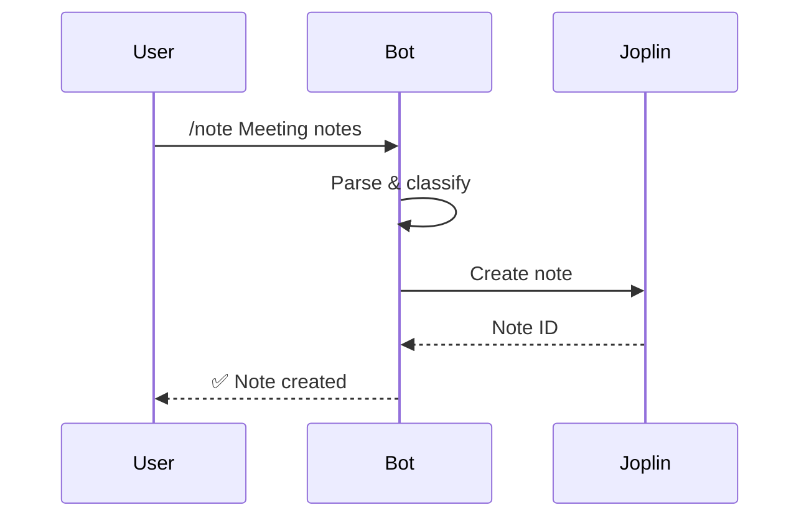
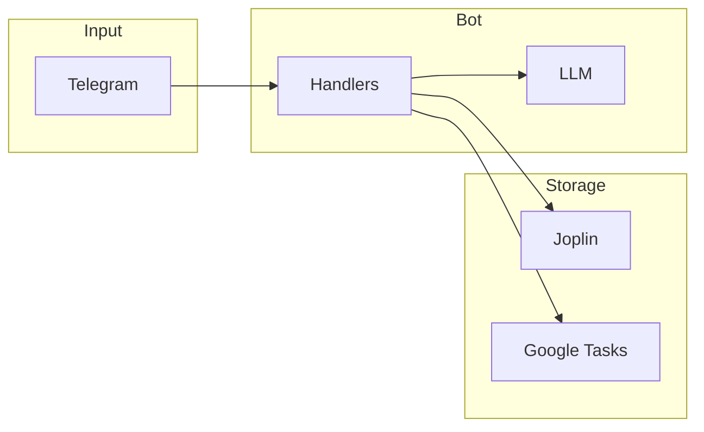

# Documentation Standards

**Purpose**: Ensure consistent, readable documentation across backlog items, sprint plans, and process docs.

## Charts and Graphs: Use Mermaid

> **Always use Mermaid for charts and graphs.** Do not use ASCII art, images, or other formats for flowcharts, sequence diagrams, or architecture diagrams.

### Why Mermaid

- Renders in GitHub, GitLab, and most Markdown viewers
- Version-controlled (text-based)
- Easy to update and diff
- Supports flowcharts, sequence diagrams, class diagrams, state diagrams, and more

### Examples

**Flowchart**:



**Sequence diagram**:



**Architecture**:



### When to Use Mermaid

- **Flowcharts**: Process flows, decision trees, routing logic
- **Sequence diagrams**: Message/API flows, multi-step interactions
- **State diagrams**: Conversation states, lifecycle
- **Architecture diagrams**: System components, data flow
- **Class/ER diagrams**: Data models (when helpful)

### Mermaid: Avoiding Lexical Errors

Node labels with special characters can cause **"Lexical error: Unrecognized text"** in Mermaid. To avoid this:

1. **Wrap labels in double quotes** when they contain:
   - Forward slash `/` (e.g. commands like `/braindump`)
   - Equals `=`, colons `:`, parentheses `()`, brackets `[]`
   - Other symbols that may be parsed as syntax

2. **Correct**:
   ```mermaid
   flowchart TD
       A["User: /braindump quick"]
       B["Parse: mode=quick"]
   ```

3. **Incorrect** (causes lexical error):
   ```mermaid
   flowchart TD
       A[/braindump quick]
       B[Parse: mode=quick]
   ```

4. **Validate before committing**: Paste diagrams into [Mermaid Live Editor](https://mermaid.live/) to verify they render.

### Reference

- [Mermaid documentation](https://mermaid.js.org/)
- [Mermaid flowchart syntax — special characters](https://mermaid.js.org/syntax/flowchart.html)
- [Mermaid live editor](https://mermaid.live/) for quick diagrams and validation

---

**Last Updated**: 2026-03-05
